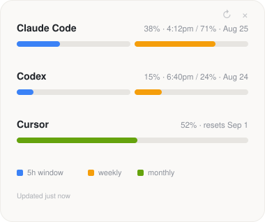

# AI Usage Widget

A small desktop widget (built with [Tauri v2](https://v2.tauri.app)) that shows, at a glance, how much of your usage quota you've burned on **Claude Code**, **Codex**, and **Cursor** — so you can tell which one still has headroom right now.



*(Illustrative sample data, not a live account.)*

It's a borderless, always-visible floating window — no dock icon, no menu-bar icon — that you drag to wherever you want on screen (drag from the thin strip along the top edge) and quit from the small `×` in the corner. It polls every 30 minutes in the background and refreshes once more on launch; the `↻` button next to the `×` forces an immediate refresh. If a background refresh fails, the last good numbers stay on screen but the affected row gets an amber `⚠` (hover for the reason) and the footer notes "last refresh failed", rather than silently freezing at some "Updated Xh ago".

## Tested platforms

**macOS only.** That's the only platform this has actually been run and verified on (Apple Silicon + Intel, via a universal binary). The provider code has Windows/Linux file paths written in based on each tool's documented/reverse-engineered locations, but none of it has been exercised on those platforms — treat Windows/Linux as unverified, not supported, until someone's actually tried it and reported back.

## Download

Prebuilt macOS app: [`bin/ai-usage-widget-macos.dmg`](bin/ai-usage-widget-macos.dmg). It's unsigned (no Apple Developer certificate), so on first launch macOS will refuse to open it normally — right-click the app → **Open**, or go to **System Settings → Privacy & Security → Open Anyway** after the first attempt.

Or build it yourself — see [Development](#development) below.

## How each integration works, and why

Every tool needs both a live "source of truth" number and a fast local cache, since usage can be shared across surfaces (e.g. Claude Code and claude.ai share one pool) and local logs alone can't see multi-device usage or the server's actual reset clock. **No custom OAuth is implemented anywhere in this app** — it always reuses each tool's own sanctioned login and reads the credential file/keychain entry that tool's own CLI already writes.

### Claude Code — stable

- **Credential**, in the same priority order Claude Code CLI itself uses: the `CLAUDE_CODE_OAUTH_TOKEN` environment variable (a long-lived token from `claude setup-token`) first, then macOS Keychain service `"Claude Code-credentials"` (read via the `security` CLI), then `~/.claude/.credentials.json` on Linux/Windows (respects `CLAUDE_CONFIG_DIR`) — the Linux/Windows path is written but unverified, see [Tested platforms](#tested-platforms). The env var only has any effect when the widget is launched from a shell that has it exported — a normal double-click/Finder launch doesn't inherit shell environment variables, a macOS limitation this app can't work around. This is specifically the Claude Code CLI's own session — it's unrelated to, and can't see, a separate Claude Desktop (claude.ai chat app) login; Anthropic keeps those credentials in genuinely separate stores, and Claude Desktop's is deliberately locked to its own signed binary so no other app (including this one) can read it.
- **Live call**: `GET https://api.anthropic.com/api/oauth/usage` — undocumented but the same endpoint the CLI itself calls, with the `anthropic-beta: oauth-2025-04-20` header.
- **Token refresh**: Claude Code's access tokens are short-lived and the CLI normally refreshes its own silently whenever it runs — but nothing triggers that if this widget is the only thing reading the credential, so a token can go stale between actual CLI uses. To avoid nagging you to `claude login` for what's really just an expired short-lived token, the widget refreshes it itself using the refresh token already in the credential, via Claude Code CLI's own public OAuth client ID against `POST https://platform.claude.com/v1/oauth/token` (`grant_type=refresh_token`) — the same narrow "extend an already-granted session" operation the CLI itself performs, not a new interactive login.
- **Its own refresh-token cache**: refresh tokens are commonly single-use/rotating — each successful refresh can invalidate the one used to get it and issue a new one. Since the widget never writes back to Claude Code's own Keychain entry (that store isn't ours to own), it keeps its *own* small Keychain item (service `ai-usage-widget`, account `claude-oauth-cache`) holding only whichever access/refresh token pair it most recently obtained, and prefers that over Claude Code's copy when it's newer. Without this, the widget's own refreshes would eventually stand on a rotated-away refresh token and start failing even though Claude Code's own CLI usage was working fine the whole time. This cache is still just a token — same handling as any other credential here, Keychain only, never plaintext.
- **Log-in**: the widget shells out to `claude login` (opens your browser; Claude Code writes its own credential afterward). The widget never touches your password or handles the initial interactive OAuth grant itself.
- **Rate-limit backoff**: this endpoint's rate limit appears to be a sliding window, not a fixed cooldown — polling it again while already blocked seems to extend the block rather than just failing (observed empirically: an overnight run at the normal 5-minute poll interval never recovered on its own). So a `429` here triggers a 30-minute backoff before the widget tries this endpoint again, instead of retrying every cycle and potentially keeping the block alive indefinitely. This state is in-memory only and resets on app restart.
- **Offline fallback**: if there's no credential yet and no cached snapshot, it scans recent `~/.claude/projects/**/*.jsonl` session transcripts and turns recent request counts into a rough percentage against fixed baselines (50 requests ≈ 100% of the 5h window, 250 ≈ 100% of the week). This is **not** a real quota calculation — it's a best-effort estimate only used before the first successful live fetch, and is labeled "(est.)" in the UI.

### Codex — stable

- **Credential**: `~/.codex/auth.json` (respects `CODEX_HOME`), specifically `tokens.access_token` / `tokens.account_id`.
- **Live call**: `GET https://chatgpt.com/backend-api/wham/usage` with `ChatGPT-Account-Id` when available — the same undocumented endpoint the Codex CLI/TUI's `/status` view is backed by.
- **Log-in**: shells out to `codex login`, same pattern as Claude Code.

### Cursor — fragile, by far the most likely thing to break silently

Cursor has no unified login flow to shell out to. This integration tries **two independent local sessions automatically** — whichever is present and working wins, so it works whether you use the Cursor IDE, the `cursor-agent` CLI, or both, with no configuration needed.

**1. Cursor IDE**, via two things Cursor itself owns and was never meant for third parties to read:
   - **`state.vscdb`** — Cursor's own VS Code-style SQLite key/value store (`~/Library/Application Support/Cursor/User/globalStorage/state.vscdb` on macOS — the only path actually verified; `%APPDATA%\Cursor\User\globalStorage\state.vscdb` on Windows and `$XDG_CONFIG_HOME/Cursor/User/globalStorage/state.vscdb` on Linux are written but unverified). It's opened **read-only** and is safe to read alongside a running Cursor — Cursor doesn't lock it. The widget runs `SELECT value FROM ItemTable WHERE key = 'cursorAuth/accessToken' LIMIT 1;`.
   - That access token is a JWT. The widget decodes its `sub` claim (no signature verification — it's not being trusted as a security boundary, just reused as Cursor's own already-logged-in session) to get a user ID, then derives Cursor's **first-party web session cookie**: `Cookie: WorkosCursorSessionToken={userID}::{accessToken}`. That cookie — not the raw token — is what's sent to `GET https://cursor.com/api/usage-summary`, an undocumented, unversioned endpoint.

**2. `cursor-agent` CLI** (`agent login` / `CURSOR_API_KEY`), which keeps a completely separate, opaque `crsr_...` API key — not a JWT — at one of `~/.config/cursor/auth.json`, `~/.config/cursor/credentials.json`, or `~/.cursor/credentials.json` depending on version/platform. **None of this is documented by Cursor** — the paths and field names come from community reverse-engineering (an strace against the actual binary), not an official source, so treat this path as more experimental than the IDE one. The widget tries this key as a bearer token (`Authorization: Bearer crsr_...`) against the same `usage-summary` endpoint; Cursor doesn't document a usage API for personal API keys, so this may simply not be authorized on any given account — if so, it fails silently and falls back to whatever the IDE source produces (or to the auth-expired state if neither works).

Any of these paths, key names, or endpoints could change without notice on a Cursor update, silently breaking this integration. If nothing is found, a token fails to decode, or every API call fails, the widget shows an explicit **"Cursor auth expired — reopen Cursor to refresh"** state rather than a stale or fabricated number — there's no refresh-token flow available to drive this programmatically, so reopening Cursor (or re-running `agent login`) is the actual fix.

Cursor has no short rolling window like Claude/Codex — just a monthly reset, shown as a single bar. If your plan has an on-demand/overage pool and you've spent from it, that shows as a small secondary line under the bar rather than a second bar, to keep the glance-read simple.

## Storage & privacy

- This app never writes any credential or token to plaintext disk. Each provider re-reads its source of truth (keychain / credential file / Cursor's own local database) on every refresh; the one exception is Claude's own refresh-token cache described above, which exists only in the OS Keychain, never on disk.
- The only thing persisted to plaintext disk is the last-known-good *usage snapshot* (percentages and reset labels, no tokens) at `<app data dir>/usage-cache.json`, so the widget has something to show instantly on launch before the first live fetch completes.
- Polling runs every 30 minutes — this is a glance tool, not a real-time dashboard, and these are undocumented endpoints with unpublished rate limits.
- **Polling resilience**: the background poll loop runs for the entire life of the app, so it's specifically hardened against a single bad cycle taking it down permanently (which would otherwise look like the widget just silently freezing at some "Updated Xh ago" forever, with no crash and no indication anything was wrong). Each cycle runs in its own isolated task rather than inline in the loop, so an unexpected panic in one cycle can't kill all future ones. Every outbound HTTP request has an explicit 15s timeout (`reqwest::Client` has none by default — an unbounded hang from something like waking from sleep with a half-broken network stack could otherwise block a cycle forever), and the whole cycle additionally has a 90s outer timeout as a backstop, which also covers non-HTTP blocking calls (like the synchronous `security` Keychain CLI invocations, which have no timeout of their own).
- **Sleep/wake**: due-ness is tracked against the wall clock, not a single long `tokio::time::sleep`. A monotonic sleep is *frozen* while macOS is asleep, so a 30-minute timer started before a two-hour lid-close only fires 30 minutes after waking — the widget just sits stale the whole time. The loop instead wakes on a short interval and compares elapsed wall-clock time, so a wake is noticed as "overdue" within a minute and it refreshes on its own; the `↻` button is there for when you don't want to wait even that long.

## Development

```bash
npm install
npm run tauri dev
```

Requires the Rust toolchain (`rustup`) in addition to Node.

## Out of scope for v1

- Burn-rate/pace indicators — plain % + reset date only.
- Custom OAuth app registrations with Anthropic/OpenAI/Cursor (none currently offer one for third parties).
- Windows/Linux window-chrome polish beyond what's implemented — flagged for follow-up as encountered, not pre-solved.

## License

[MIT](LICENSE)
